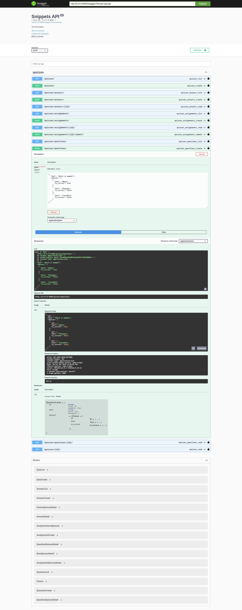
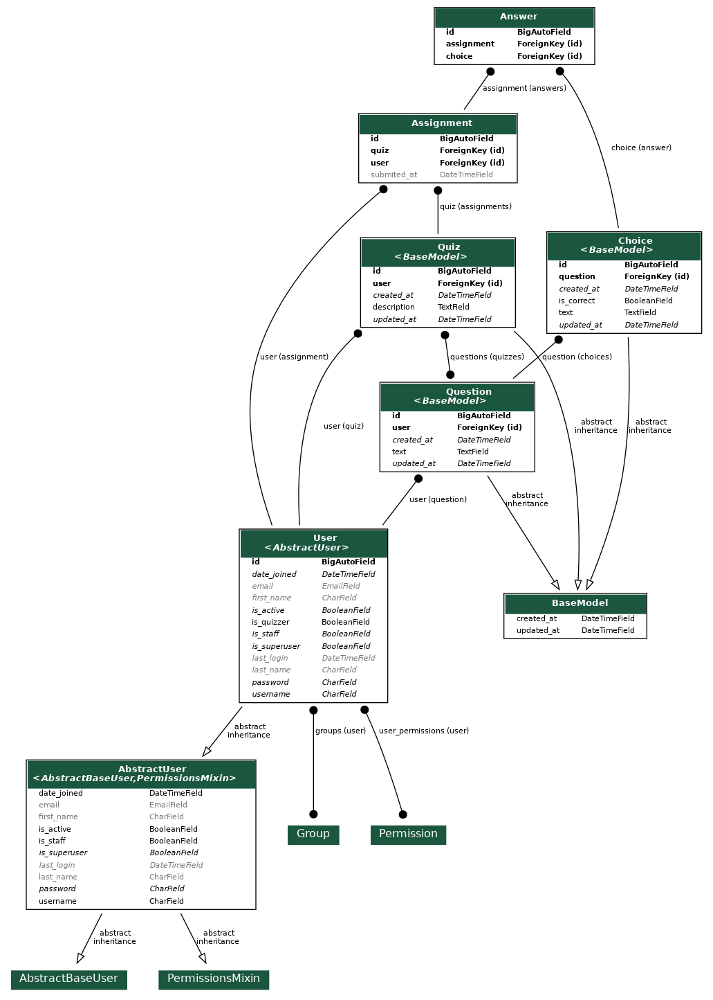

# Engineering Assessment

## Requirements

- Docker
- docker compose

## Getting started

Build the docker container and run the container for the first time
```docker compose up```

Rebuild the container after adding any new packages
``` docker compose up --build```

The run command script creates a super-user with username & password picked from `.env` file


Once the service is running, it should be available through your web browser here: [http://0.0.0.0:8000/](http://0.0.0.0:8000/)

It should automatically redirect to the Swagger UI page:



## TODO's

Due to the limited time available for completing this challenge, I implemented only the minimum resources/operations to be compliant
with the requirements (essentially creating a MVP).

- Add DELETE operation to all resources.
- Add UPDATE operation to all resources.
- Add BULK CREATE to `/quizzes/answers` (That so multiple answers can be created at the same time rather than one by one).
- Add `/users/` resource (so quizzers can get the user ID's to create assignments, at the moment, getting the ID of the user
can be found using Django admin).

The implemented resources/operations should be enough to comply to the requirements.

Creator (Quizzer):

- Build a quiz (Note that a quiz cannot be deleted nor updated without implementing the todo's).
- Check up on the progress of the quiz (Progress can be checked through `/quizzes/assignments/`).
- Check up on the scores of the quiz (Progress can be checked through `/quizzes/assignments/`).
- Only see quizzes relevant to me (Quizzers can only see quizzes created by them).

Participant (Quizzee):

- Accept an invitation (An invitation consists on creating an assignment for the user through `/quizzes/assignments/`).
- Participate in the quiz (Answers can be submitted to assignments uisng `/quizzes/answers`, however, cannot be deleted nor updated without implementing the todo's).
- Check up on the progress of the quiz (Progress can be checked through `/quizzes/assignments/`).
- Only see quizzes relevant to me (Quizzees can only see quizzes assigned to them).

Note also that the views will return different payloads depending on the user, e.g., if the user is a quizzee and retrieves
a quiz, they payload will not show which answers are correct. If the user is a quizzer and retrives the same quiz, the payload
will show which answers are correct.

## Database Models

Follows a diagram of the models defined for this project:



Note that `User` has been extended to include a new field, `is_quizzer` (Creator). An user is either a creator (quizzer)
or participant (quizzee).

When an `Assignment` has been created, this means the user has been invited to a quiz.

## Manual Testing

Just for the sake of illustrating how the API works, here's a follow along example.

You might want to use the Swagger UI page for this task:


## Creating Users

We are required the following users for this example:

- biology_quizzer (Quiz Creator, `is_quizzer=true`).
- geography_quizzer (Quiz Creator, `is_quizzer=true`).
- bob_quizzee (Quiz Takerm, `is_quizzer=false`).
- alice_quizzee (Quiz Taker, `is_quizzer=false`).

### Creating Questions

#### Create a Biology Question

You must login with biology_quizzer.

The question will belong to the authenticated user.

POST to `/quizzes/questions`:

```json
{
  "text": "Which is mammal?",
  "choices": [
    {
      "text": "Whale",
      "is_correct": true
    },
    {
      "text": "Platypus",
      "is_correct": false
    },
    {
      "text": "Crocodile",
      "is_correct": false
    }
  ]
}
```

#### Create a Geography Questions

You must login with geography_quizzer

POST to `/quizzes/questions`:

```json
{
  "text": "What's the capital of Belgium?",
  "choices": [
    {
      "text": "Brussels",
      "is_correct": true
    },
    {
      "text": "Zurich",
      "is_correct": false
    },
    {
      "text": "Amsterdam",
      "is_correct": false
    }
  ]
}
```

POST to `/quizzes/questions`:

```json
{
  "text": "Which are European countries?",
  "choices": [
    {
      "text": "Belgium",
      "is_correct": true
    },
    {
      "text": "Switzerland",
      "is_correct": true
    },
    {
      "text": "Japan",
      "is_correct": false
    }
  ]
}
```

### Create Quizzes
#### Create a Biology Quiz

You must login with biology_quizzer.

POST to `/quizzes/`:

```json
{
  "description": "Biology Quiz",
  "questions": [
    1
  ]
}
```

#### Create a Geography Quiz

You must login with geography_quizzer.

POST to `/quizzes/`:

```json
{
  "description": "Geography Quiz",
  "questions": [
    2, 3
  ]
}
```

### Create an Assignment for a Quiz

You may use any quizzer to create an assignment. Quizzees are not allowed to create assignments.

POST to `/quizzes/assignments/`:

```json
{
    "user": 5,
    "quiz": 1
}
```

Creates an assignment for the biology quiz for user bob_quizzee.

POST to `/quizzes/assignments/`:

```json
{
    "user": 6,
    "quiz": 2
}
```

Creates an assignment for the geography quiz for user alice_quizzee.

### Answer to a Question

#### Answer to Biology Assignment
POST to `/quizzes/answers/`:

You must login with bob_quizzee.

```json
{
  "assignment": 1,
  "choice": 1
}
```

#### Answer to Geography Assignment

POST to `/quizzes/answers/`:

You must login with alice_quizzee.

```json
{
  "assignment": 2,
  "choice": 4
}
```

This will answer to the geography question "What's the capital of Belgium?" with the choice "Brussels". 

### Submit an Assignment

POST to `/quizzes/assignments{id}/submit` (no payload)

This will set `submitted_at` to the current date and time (Once the assignment is submitted, answers can no longer be created for it).

## Running Tests

```bash
pytest --log-cli-level=INFO
pytest --log-cli-level=DEBUG
```

You may change the logging level according to your own needs.

You should get an output similar to this:

```bash
$ make tests
pytest --log-cli-level=INFO
============================================== test session starts ==============================================
platform linux -- Python 3.10.13, pytest-8.2.2, pluggy-1.5.0
django: version: 5.0.6, settings: oper.settings (from ini)
rootdir: /home/marcio/Workspace/OperCredits/backend-engineering-assessment
configfile: pytest.ini
plugins: Faker-25.8.0, django-4.8.0
collected 30 items                                                                                                                                                                                                                           
quiz/tests/test_models.py::ModelsTest::test_answered_only_multiple_correct_answers_question PASSED       [  3%]
quiz/tests/test_models.py::ModelsTest::test_answered_only_single_correct_answer_question PASSED          [  6%]
quiz/tests/test_models.py::ModelsTest::test_missed_all_questions PASSED                                  [ 10%]
quiz/tests/test_models.py::ModelsTest::test_scored_all_questions PASSED                                  [ 13%]
quiz/tests/test_models.py::ModelsTest::test_scored_only_multiple_correct_answers_question PASSED         [ 16%]
quiz/tests/test_models.py::ModelsTest::test_scored_only_single_correct_answer_question PASSED            [ 20%]
quiz/tests/test_views.py::QuestionViewSetTests::test_create_question PASSED                              [ 23%]
quiz/tests/test_views.py::QuestionViewSetTests::test_get_question PASSED                                 [ 26%]
quiz/tests/test_views.py::QuestionViewSetTests::test_get_specific_user_questions PASSED                  [ 30%]
quiz/tests/test_views.py::QuestionViewSetTests::test_quizzee_attempt_create_question PASSED
WARNING  django.request:log.py:241 Forbidden: /quizzes/questions/                                        [ 33%]
quiz/tests/test_views.py::QuizViewSetTests::test_create_quiz PASSED                                      [ 36%]
quiz/tests/test_views.py::QuizViewSetTests::test_get_quizzee_quizzes PASSED                              [ 40%]
quiz/tests/test_views.py::QuizViewSetTests::test_get_specifc_quiz PASSED                                 [ 43%]
quiz/tests/test_views.py::QuizViewSetTests::test_get_specific_user_quizzes PASSED                        [ 46%]
quiz/tests/test_views.py::QuizViewSetTests::test_quizzee_attempt_create_quiz PASSED
WARNING  django.request:log.py:241 Forbidden: /quizzes/                                                  [ 50%]
quiz/tests/test_views.py::AssignmentViewSetTests::test_create_assigment PASSED                           [ 53%]
quiz/tests/test_views.py::AssignmentViewSetTests::test_get_assignment PASSED                             [ 56%]
quiz/tests/test_views.py::AssignmentViewSetTests::test_get_quizzee_assignments PASSED                    [ 60%]
quiz/tests/test_views.py::AssignmentViewSetTests::test_get_quizzee_assignments_filtered_by_quiz PASSED   [ 63%]
quiz/tests/test_views.py::AssignmentViewSetTests::test_get_quizzer_assignments PASSED                    [ 66%]
quiz/tests/test_views.py::AssignmentViewSetTests::test_get_quizzer_assignments_filtered_by_user PASSED   [ 70%]
quiz/tests/test_views.py::AssignmentViewSetTests::test_quizzee_attempt_create_assigment PASSED
WARNING  django.request:log.py:241 Forbidden: /quizzes/assignments/                                      [ 73%]
quiz/tests/test_views.py::AssignmentViewSetTests::test_quizzer_attempt_submit_assignment PASSED
WARNING  django.request:log.py:241 Forbidden: /quizzes/assignments/1/submit/                             [ 76%]
quiz/tests/test_views.py::AssignmentViewSetTests::test_submit_assignment PASSED                          [ 80%]
quiz/tests/test_views.py::AnswerViewSetTests::test_attempt_create_answer_for_submitted_assignment PASSED
WARNING  django.request:log.py:241 Bad Request: /quizzes/answers/                                        [ 83%]
quiz/tests/test_views.py::AnswerViewSetTests::test_attempt_create_answer_with_invalid_choice PASSED
WARNING  django.request:log.py:241 Bad Request: /quizzes/answers/                                        [ 86%]
quiz/tests/test_views.py::AnswerViewSetTests::test_create_answer PASSED                                  [ 90%]
quiz/tests/test_views.py::AnswerViewSetTests::test_get_answer PASSED                                     [ 93%]
quiz/tests/test_views.py::AnswerViewSetTests::test_get_answers PASSED                                    [ 96%]
quiz/tests/test_views.py::AnswerViewSetTests::test_quizzer_attempt_create_answer PASSED
WARNING  django.request:log.py:241 Forbidden: /quizzes/answers/                                          [100%]
==========================================  30 passed in 0.82s ========================================================
```

## Developer Hints

### Adding Dependencies

```bash
pipenv install djangorestframework
pipenv install drf-yasg
```

If you only want to add a development package:

```bash
pipenv install -d factory-boy
pipenv install -d pytest
pipenv install -d pytest-django
```

### Changing the User Password

```bash
python ./manage.py changepassword geography_quizzer
python ./manage.py changepassword biology_quizzer
python ./manage.py changepassword bob_quizzee
python ./manage.py changepassword alice_quizzee
```

### Make Shorcuts

For convinience, the following make shortcuts are available for development:

| Command              | Purpose                                                                                      |
|:---------------------|:---------------------------------------------------------------------------------------------|
| `make runserver`     | Start service.                                                                               |
| `make tests`         | Run tests.                                                                                   |
| `make format`        | Formats code and organize imports using black and isort.                                     |
| `make format_check`  | Only checks formatting (meant to be used in CI).                                             |
| `make quality_check` | PyLint (configuration [here](./.pylintrc)) & MyPy (configuration [here](./mypy.ini)) checks. |

